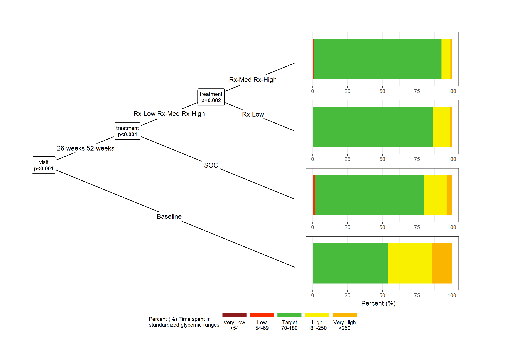

```{=html}
<style>
element.style {
width: 900px;
height: 550px;
margin-top: 10px;
margin-bottom: 10px;
}
</style>
```

```{css, echo=FALSE}
.bgwhite {
   background-color: white;
}
```

```{r knitr-defaults}
knitr::opts_chunk$set(warning = FALSE, message = FALSE, comment = NA)
knitr::opts_chunk$set(cache = FALSE)
options(width=170)
```

```{r load-packages}
pacman::p_load(tidyverse, rio, gt, gtsummary)
pacman::p_load(labelled)
pacman::p_load(patchwork)
pacman::p_load(iglu)
pacman::p_load(partykit, ggparty)
pacman::p_load(ggdist)
```

```{r import-reshape-label}
CGM_data_1 <- import('https://raw.githubusercontent.com/VIS-SIG/Wonderful-Wednesdays/master/data/2021/2021-08-11/simulated_data.csv')

CGM_data_2 <- CGM_data_1 %>% 
   rename(VISITNUM_N = VISITNUM) %>% 
   mutate(VISITNUM_C = factor(VISITNUM_N, labels = c('Baseline','26-weeks','52-weeks')),
          VISITNUM_M = case_when(VISITNUM_N == 3  ~ '01',
                                 VISITNUM_N == 17 ~ '06',
                                 VISITNUM_N == 21 ~ '12'),
          TREATMENT = factor(TREATMENT ) %>% 
             fct_relevel("SOC","Rx low","Rx medium","Rx high") %>% 
             fct_recode(`Rx-Low` = "Rx low",
                        `Rx-Med` = "Rx medium",
                        `Rx-High` = "Rx high")) %>% 
   rename(VALUE_ORIG = 'Original_CGMValue',
          VALUE_SIM  = 'Simulated_CGMValue',
          TIME = 'CGMTIME',
          DAY = 'CGMDAY') %>% 
   select(SUBJID, TREATMENT,
          VISITNUM_N, VISITNUM_C, VISITNUM_M,
          DAY, TIME,
          VALUE_ORIG, VALUE_SIM) %>% 
   mutate(DAY_TIME = as.POSIXct(str_glue("2021-{VISITNUM_M}-0{DAY} {TIME}:00")),
          .after = TIME) 

var_label(CGM_data_2) <- list(
   SUBJID     = 'Subject Identification',
   TREATMENT  = 'Treatment Regimen',
   VISITNUM_N = 'Study visit NUM',
   VISITNUM_M = 'Study visit MONTH',
   VISITNUM_C = 'Study Visit NAME',
   DAY        = 'Day the CGM was measured',
   TIME       = 'Time of the day that the CGM value was measured',
   DAY_TIME   = 'Day/Time created',
   VALUE_ORIG =  'Original CGM value',
   VALUE_SIM  =  'Simulated CGM value')

export(CGM_data_2, "CGM_data.rds")
```

```{r iglue-function}
plot_ranges_2 <- function (data) {
   
   gl = id = below_54 = below_70 = in_range_70_180 = above_180 = above_250 = percent = NULL
   
   rm(list = c("gl", "id", "below_54", "below_70", "in_range_70_180", "above_180", "above_250", "percent"))
   subject = unique(data$id)
   ns = length(subject)
   if (ns > 1) {
      subject = subject[1]
      warning(paste("The provided data have", ns, "subjects. The plot will only be created for subject", subject))
      data = data %>% filter(id == subject)
   }
   
   ranges <- agp_metrics(data, shinyformat = FALSE) %>% 
      select(-c("id", "active_percent", "mean", "GMI", "CV")) %>% 
      summarise(range = c("very_low", "low", "target", "high", "very_high"), 
                percent = c(below_54, below_70 - below_54, in_range_70_180, above_180 - above_250, above_250))
   
   ranges = ranges %>% 
      mutate(range = factor(range, levels = c("very_high",  "high", "target", "low", "very_low")))
   
   colors <- c("#F9B500", "#F9F000", "#48BA3C", "#F92D00", "#8E1B1B")
   
   ggplot(data = ranges, mapping = aes(y = '', fill = range, x = percent)) + 
      geom_bar(stat = "identity") + 
      scale_fill_manual(values = colors, 
                        drop = FALSE,
                        labels = c("Very High\n>250", 
                                   "High\n181-250", 
                                   "Target\n70-180", 
                                   "Low\n54-69", 
                                   "Very Low\n<54")) + 
      scale_x_continuous(breaks = seq(0, 100, 25)) + 
      labs(x = NULL,
           y = NULL,
           fill = "Percent (%) Time spent in \nstandardized glycemic ranges") + 
      scale_y_discrete(breaks = NULL) +
      guides(fill = guide_legend(reverse = TRUE,
                                 label.position = 'bottom')) 
}
```

```{r iglu-derive}
options(warn=-1)

CGM_iglu_data <- CGM_data_2 %>% 
   mutate(studyid = SUBJID) %>% 
   process_data(id = "SUBJID", timestamp = "DAY_TIME", glu = "VALUE_ORIG") %>% 
   select(-visitnum_n, -visitnum_m, -time.1, -value_sim, -day) %>% 
   rename(visit = visitnum_c) %>% 
   nest_by(studyid, treatment, visit)

CGM_iglu_data <- CGM_iglu_data %>% 
   ungroup() %>% 
   add_count(studyid, name = 'visit_n')

CGM_iglu_metrics <- CGM_iglu_data %>%
   rowwise() %>% 
   mutate(all_metrics  = list( data %>% data.frame() %>% all_metrics() )) %>% 
   mutate(panel     = list( 
      (plot_ranges_2(data)) / 
         (guide_area()) / 
         (plot_agp(data)   + ylim(39, 401)) / 
         (plot_daily(data) + ylim(39, 401) +
             geom_ribbon(aes(reltime, ymin = 70, ymax = 180), fill = "#48BA3C", alpha = 0.3) +
             geom_hline(yintercept = c(70, 180), color = "#48BA3C")) /
         plot_layout(heights = c(1, 1, 3, 3),
                     guides = 'collect') &
         theme_bw() &
         theme(legend.position='bottom',
               legend.key.height = unit(0.3, 'cm'),
               legend.key.width  = unit(1.5, 'cm'),
               strip.background = element_blank(), 
               strip.text = element_blank(),
               legend.title=element_text(size=9))
      
   ) 
   ) %>%
   unnest(c(all_metrics))

CGM_iglu_metrics %>% 
   select(studyid, treatment, visit, visit_n, data) %>% 
   export('CGM_iglu_data.rds')

CGM_iglu_metrics %>% 
   select(-panel, -data, -id) %>% 
   export('CGM_iglu_stats.rds')
```

# VISUALIZATION {data-navmenu="AGP"}
```{r iglu-trelliscope}
pacman::p_load(trelliscopejs)

CGM_iglu_metrics %>% 
   select(studyid, treatment, visit, visit_n,
          ADRR, AUC, COGI, Conga, CV, CV_Measures_Mean, CV_Measures_SD, eA1C, GMI, 
          GRADE, GRADE_eugly, GRADE_hyper, GRADE_hypo, GVP, HBGI, hyper_index, hypo_index, 
          IGC, J_index, LBGI, M_value, MAD, MAG, MAGE, Mean, Median, MODD, range, SD, SD.Roc, 
          SDb, SDbdm, SDdm, SDhhmm, SDw, SDwsh,
          panel) %>% 
   ungroup() %>% 
   set_labels(list(ADRR = 'average daily risk range', 
                   AUC = 'Area Under Curve', 
                   COGI = 'Continuous GlucoseMonitoring Index', 
                   Conga = 'Continuous Overall Net Glycemic Action', 
                   eA1C = 'Estimated A1c', 
                   GMI = 'Glucose Management Indicator', 
                   GVP = 'Glucose Variability Percentage', 
                   HBGI = 'High Blood Glucose Index', 
                   LBGI = 'Low Blood Glucose Index', 
                   IGC = 'Index of Glycemic Control')) %>%
   mutate(across(where(is.numeric), ~round(.x, 2))) %>% 
   trelliscope(name = 'CGM: Continuous Glucose Monitoring Visualization',
               desc = 'Display Ambulatory Glucose Profile (AGP) statistics',
               panel_col = 'panel',
               path = './CGM-trelliscope',
               ncol = 3,
               nrow = 1,
               height = 900,
               width  = 700,
               state = list(sort = list(sort_spec('studyid'))))
```

# HELP PLOT AGP {data-navmenu="AGP"}
```{r, out.width="1000px", out.extra="data-external=1"}
pacman::p_load(webshot)
knitr::include_url("https://irinagain.github.io/iglu/reference/plot_agp.html", height = "800px")
```

# HELP PLOT RANGES {data-navmenu="AGP"}
```{r, out.width="1000px", out.extra="data-external=1"}
knitr::include_url("https://irinagain.github.io/iglu/reference/plot_ranges.html", height = "800px")
```

# HELP PLOT DAILY {data-navmenu="AGP"}
```{r, out.width="1000px", out.extra="data-external=1"}
knitr::include_url("https://irinagain.github.io/iglu/reference/plot_daily.html", height = "800px")
```

# MODEL RESULTS
```{r party-model}
CGM_data_m1 <- CGM_iglu_metrics %>%
   select(studyid, treatment, visit, data) %>%
   rowwise() %>% 
   mutate(below_percent(data, targets_below = 53.9)[2], 
          below_percent(data, targets_below = 69.9)[2], 
          in_range_percent(data, target_ranges = list(c(70, 180)))[2], 
          above_percent(data, targets_above = 180.1)[2], 
          above_percent(data, targets_above = 250.1)[2]) %>% 
   mutate(below_69.9 = below_69.9 - below_53.9, 
          above_180.1 = above_180.1 - above_250.1) %>%
   select(-data) %>% 
   pivot_longer(cols = -c(1:3),
                names_to = 'state',
                values_to = 'pct') %>% 
   mutate(state = as.factor(state) %>% 
             fct_relevel('below_53.9',
                         'below_69.9',
                         'in_range_70_180',
                         'above_180.1',
                         'above_250.1') %>% 
             fct_rev()) 

target_plot <- CGM_data_m1 %>% 
   lmtree(pct ~ state | treatment + visit, data = .,
          alpha = 0.10, bonferroni  = FALSE) %>% 
   ggparty(terminal_space = 0.4, horizontal = TRUE) +
   geom_edge() +
   geom_edge_label() +
   geom_node_label(line_list = list(aes(label = splitvar),
                                    aes(label = gtsummary::style_pvalue(p.value, digits = 2, prepend_p = TRUE))),
                   line_gpar = list(list(size = 9),
                                    list(size = 9, fontface = 'bold')),
                   ids = "inner") +
   geom_node_plot(
      gglist = list(
         geom_bar(aes(x = pct, y = "", fill = state),
                  position = 'stack', stat = "summary", fun = "mean"),
         scale_y_discrete(breaks = NULL),
         scale_fill_manual(values = c("#F9B500", "#F9F000", "#48BA3C", "#F92D00", "#8E1B1B"), 
                           drop = FALSE, 
                           labels = c("Very High\n>250", 
                                      "High\n181-250", 
                                      "Target\n70-180", 
                                      "Low\n54-69", 
                                      "Very Low\n<54"),
                           guide = guide_legend(reverse = TRUE,
                                                label.position = 'bottom')),
         labs(y = NULL,
              x = "Percent (%)",
              fill = "Percent (%) Time spent in \nstandardized glycemic ranges"),
         theme_bw(),
         theme(legend.position='bottom',
               legend.key.height = unit(0.3, 'cm'),
               legend.key.width  = unit(1.5, 'cm'),
               strip.background = element_blank(), 
               strip.text = element_blank(),
               legend.title=element_text(size=9))),
      ids = "terminal",
      shared_axis_labels = TRUE
   )

ggsave(str_glue("CGM_target.png"),
       plot = target_plot,
       scale = 4,
       width = 900, height = 600, units = 'px')
```

{width="75%", height="75%"}

# MODEL RESULTS {data-navmenu="OTHER METRICS"}

## Inputs {.sidebar}
**Model Results Legend**    
Recursive Partytioning models results ([partykit](https://cran.r-project.org/web/packages/partykit/index.html)) using p-values to determine splits in the data. Here is the conditional inference tree which shows how and what factors contribute to the differential effect of Continuous Glucose Monitoring (CGM) during the clinical trial. The [ggparty](https://cran.r-project.org/web/packages/ggparty/index.html) function allows to use the ggplot syntax to customize the tree which allows more adjustments and is more aesthetically pleasing. Starting from the top the graphic represents:

-   [geom_rug](https://ggplot2.tidyverse.org/reference/geom_rug.html) A Rug display representing the individual responses

-   [stat_halfeye](https://mjskay.github.io/ggdist/reference/stat_sample_slabinterval.html) A probability density (or mass) function

-   [point_interval](https://mjskay.github.io/ggdist/reference/point_interval.html) Point interval representing the mean with 66% and 95% confidence interval

-   [geom_boxplot](https://ggplot2.tidyverse.org/reference/geom_boxplot.html) A boxplot to compactly displays the distribution. It visualizes five summary statistics (the median, the 25th and 75th percentiles, and two whiskers. The whisker extends +/- 1.5 * IQR from the hinges

## Column {.bgwhite}
```{r party-mod-viz}
CGM_metric <- import("CGM_metric.csv")

vars <- CGM_metric %>% 
   filter(Metric_function != '') %>% 
   arrange(Metric_function) 

for(i in vars$Metric_function){
   
   metric_run <- sym(paste(i))
   
   metric_lab <- vars %>% 
      filter(Metric_function == i) %>% 
      pull(Metric_Name)
   
   metric_plot <- CGM_iglu_metrics %>% 
      lmtree(formula(str_glue("{metric_run} ~ 1 | treatment +  visit")), 
             data = .,
             alpha = 0.10, bonferroni  = FALSE) %>% 
      ggparty(terminal_space = 0.4, horizontal = TRUE) +
      geom_edge() +
      geom_edge_label() +
      geom_node_label(line_list = list(aes(label = splitvar),
                                       aes(label = style_pvalue(p.value, digits = 2, prepend_p = TRUE))),
                      line_gpar = list(list(size = 9),
                                       list(size = 9, fontface = 'bold')),
                      ids = "inner") +
      geom_node_plot(
         gglist = list(
            stat_halfeye(aes(x = !!metric_run, y = ""), 
                         point_interval = mean_qi,
                         justification = -0.05),
            geom_rug(aes(x = !!metric_run), alpha = 0.25, sides = 't', length = unit(0.05, "npc")),
            geom_boxplot(aes(x = !!metric_run, y = ""), 
                         width = 0.30, outlier.shape = NA,
                         position = position_nudge(y = -0.25)),
            scale_y_discrete(breaks = NULL),
            labs(y = NULL,
                 x = metric_lab),
            theme_bw()),
         ids = "terminal",
         shared_axis_labels = TRUE) 
   
   ggsave(str_glue("CGM-models/{metric_run}.png"),
          plot = metric_plot,
          scale = 4,
          width = 900, height = 600, units = 'px')
}
```

```{r}
# devtools::install_github("walkerke/bsselectR")
library(bsselectR)

plots_in        <- str_glue("CGM-models/{vars$Metric_function}.png")
names(plots_in) <- vars$Metric_Name

bsselect(plots_in, 
         frame_height = "800px", frame_width = "1200px",
         style = "btn-primary",
         box_width = 'fit',
         type = "img", 
         selected = "ADRR (Average Daily Risk Range)", 
         live_search = TRUE, 
         show_tick = TRUE)
```

# DEFINITIONS {data-navmenu="OTHER METRICS"}
```{r}
CGM_metric %>% 
   gt() %>% 
   cols_move_to_end(Metric_Time_dependent) %>% 
   cols_move(Metric_function, Metric_Name) %>% 
   cols_label(Metric_function = 'iglu R output',
              Metric_Name = "Name",
              Metric_Iglu = "iglu R function",
              Metric_Time_dependent = "Time Dependent") %>% 
   fmt_missing(Reference, missing_text = "-") %>% 
   fmt_markdown(c(Reference, Metric_Iglu)) %>% 
   cols_align('left') %>% 
   cols_width(Metric_Name ~ px(450),
              Metric_Iglu ~ px(250),
              Reference ~ px(250)) %>% 
   tab_options(table.font.size = "medium", 
               data_row.padding = px(2), 
               footnotes.padding = px(2), 
               source_notes.padding = px(2))
```